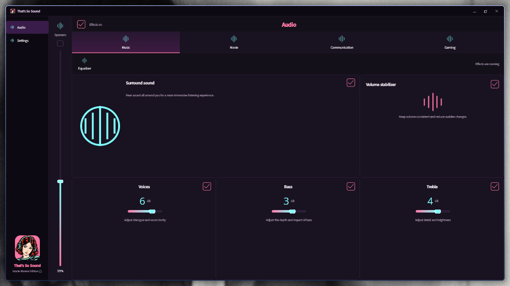

<div align="center">

  

  <br/><br/>

  <p>
    <a href="#-fitur-unggulan"></a>
    <a href="#-arsitektur-cara-kerja"></a>
    <a href="#-persiapan--build"></a>
    <a href="#-hardware-limits"></a>
    <a href="#-lisensi"></a>
  </p>

  <p align="center">
    <b>🎧 High-Performance Studio Audio DSP & Speaker Enhancer for Linux Laptops 🎧</b><br/>
    <i>"I heard you're talkin' to her again... tapi speaker laptop gua tetep kedengeran nendang & jernih!"</i> ✨
  </p>

</div>

---

## 📸 Tampilan Aplikasi (Preview)

Ini dia tampilan **That's So Sound (Gracie Abrams Edition)** di desktop Linux! Dark pop-art aesthetic dengan aksen *Gracie Pink* & *Electric Cyan*:

<div align="center">
  
  <br/>
  <em>Tampilan panel That's So Sound: Equalizer, Bass/Treble/Voice sliders, Virtual Surround, dan profil Music aktif.</em>
</div>

---

## 🧐 Apaan nih Proyekan?

Pernah ga ngerasa speaker laptop lo di Linux suaranya **cempreng, tipis, pelan**, atau ga ada bass-nya sama sekali dibanding pas masih di Windows? Itu bukan karena speakernya jelek, tapi karena **DSP tuning bawaan pabrik cuma aktif di Windows**!

**That's So Sound** nge-bridge runtime resmi **Nahimic APO4 (driver tuning Windows asli)** langsung ke audio server Linux modern (**PipeWire**) lewat bantuan Wine:
- 🚀 **Bukan** me-reverse engineer atau bikin algoritma DSP abal-abal dari nol.
- 🎛️ Memproses stream audio menggunakan file `.dll` resmi pabrikan dengan profile OEM asli.
- 🎨 Dilengkapi **Qt (PySide6) GUI** bertema dark pop-art terinspirasi lagu *That's So True* by Gracie Abrams.
- 💡 **Service & GUI Terpisah**: Mesin audionya jalan di background (`systemd user service`), jadi kalau panel GUI-nya lu tutup, musiknya tetep jalan terus tanpa jeda!

---

## 🎚️ Fitur Unggulan

| Fitur | Deskripsi |
| :--- | :--- |
| 🎵 **4 Profil Akustik** | Mode **Music**, **Movie**, **Communication**, dan **Gaming** yang disetel langsung oleh OEM. |
| 🗣️ **Voice Clarity** | Menonjolkan vokal dan frekuensi dialog biar suara orang ngomong/podcast terdengar jelas. |
| 💥 **Dynamic Bass & Treble** | Dongkrak frekuensi low & high tanpa bikin speaker pecah (*distortion-free*). |
| 🌐 **3D Virtual Surround** | Melebarkan soundstage speaker laptop lo biar serasa dengerin di ruangan luas. |
| 🎚️ **Smart Volume Stabilizer** | Ngeratain volume otomatis biar telinga lo ga kaget pas ada suara jedag-jedug mendadak. |
| 🎼 **10-Band Precision EQ** | Equalizer parametrik lengkap dari **31 Hz** sampai **16 kHz** buat fine-tuning selera telinga lo. |

---

## 💻 Laptop yang Bisa Pake (Hardware Limits)

> ⚠️ **PERINGATAN PENTING**: Profil akustik speaker tiap laptop itu dibuat khusus oleh pabrik sesuai bentuk rongga bodi fisik laptopnya. **Jangan ganti nama file atau asal pasang di laptop yang beda**, karena bisa bikin membran speaker lo jebol!

Saat ini hardware yang sudah di-whitelist & diverifikasi:
1. **MSI GF63 Thin 11UCX / MS-16R6**
   - Codec: Realtek ALC897 (`10ec0897`, subsystem `1462134c`).
   - Profil OEM: Wajib menggunakan `1462134C_InternalSpeakers.nsx`.
2. **MECHREVO Wujie 14X Pro (Upstream Original)**
   - Codec: Senary (`14f11f87`, subsystem `1d05e022`).

---

## 🛠️ Persiapan & Dependencies (Fedora)

Pastikan sistem lo pake Linux 64-bit (x86_64), PipeWire Pulse, WirePlumber 0.5+, dan systemd user session.

```sh
# 1. Install dependencies
sudo dnf install wine mingw64-gcc-c++ python3-pyside6 pulseaudio-libs-devel gcc make pkgconf-pkg-config cabextract

# 2. Build komponen native host C++
make -j4

# 3. Jalankan unit test (41 tests)
python3 -m unittest discover -s tests -v
```

---

## 📦 Runtime & Komponen Vendor

Demi kepatuhan lisensi dan hak cipta, repo ini **tidak membundel file binary Windows berpemilik** (`.exe`, `.dll`, `.cab`, atau `.nsx`).

Untuk mendownload arsip resmi vendor dengan verifikasi checksum SHA-256 otomatis:

```sh
python3 scripts/fetch-runtime.py --hardware msi-gf63-11ucx --output runtime
```

Atau kalau lo udah punya file installer/CAB Nahimic Windows bawaan laptop di lokal:

```sh
python3 packaging/extract_runtime.py /path/to/nahimic-apo4.cab /path/to/GenericNahimicRestoreTool.exe runtime --hardware msi-gf63-11ucx
```

*(Sumber OEM MSI asalnya dari `Drivers\EXT\MSI\APO4\NH3ProductSettings0.cab` dengan profil `1462134C_InternalSpeakers.nsx` dan SHA-256 terverifikasi: `d7217235268c80b6b2573acbf27f1d55aad4281c114b455e7aa9cad77ebec1a6`).*

---

## 🚀 Cara Pake & Kontrol

Cek status mesin audionya lewat terminal:

```sh
nahimic --status
systemctl --user status nahimic-msi.service
```

Buka panel kontrol GUI-nya:

```sh
nahimic-msi
```

> 💡 **Tips dari gua**: Pas pertama kali nyetel setelah install, setel volume pelan-pelan dulu dari kecil. Dengerin baik-baik, kalo ada suara sember atau speaker getar aneh, langsung matiin!

---

## 🤝 Lisensi & Attribution

- Kode komunitas & host C++: [MIT License](LICENSE).
- Runtime binary & profil tuning pabrikan: Hak cipta milik vendor / [Notice](packaging/LicenseRef-Nahimic).
- Artwork Avatar: Terinspirasi dari Gracie Abrams.


